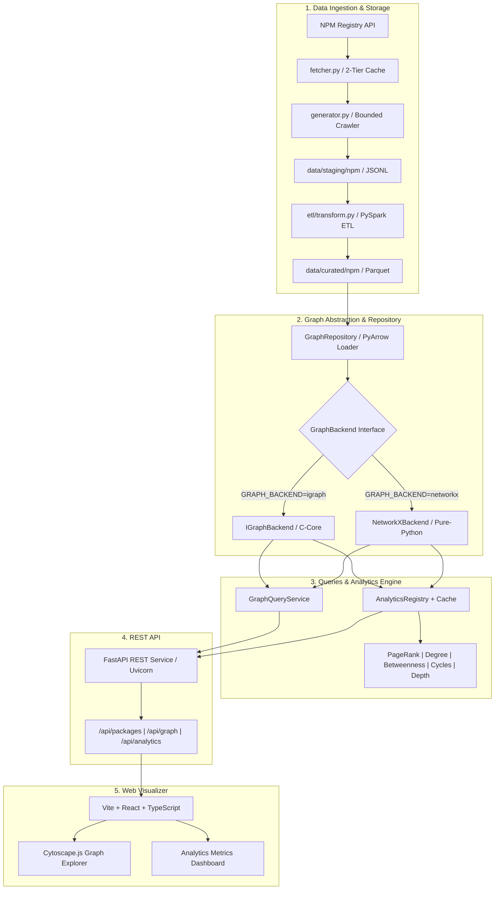

# SupplyChainLens: Software Supply Chain Graph Analytics Platform

SupplyChainLens is a high-performance, standalone graph intelligence platform designed for software dependency network analysis, vulnerability blast-radius estimation, and ecosystem structural analytics.

---

## 1. System Architecture

SupplyChainLens follows a decoupled, layered pipeline architecture:



---

## 2. Graph Backend Abstraction

SupplyChainLens provides a backend-independent graph abstraction (`GraphBackend`) in `src/supplychainlens/graph/backend.py`. The application does not directly couple to NetworkX or igraph.

### Supported Backends

* **`IGraphBackend` (Default, Recommended for Production)**:
  - Backed by `python-igraph` (C-core).
  - High performance: Computes PageRank and Betweenness across 5,900+ nodes in **< 10ms**.
  - Memory-efficient adjacency and vector processing.
* **`NetworkXBackend`**:
  - Backed by NetworkX `DiGraph`.
  - Pure-Python reference implementation.
  - Full functional parity with `IGraphBackend`.

### Switching Backends

You can switch the graph engine globally or per-request:

```bash
# Via Environment Variable:
export GRAPH_BACKEND=networkx
# or
export GRAPH_BACKEND=igraph

# Via CLI Runner:
python scripts/run_api.py --backend networkx

# Via API query parameter:
curl "http://localhost:8000/api/graph?backend=networkx"
```

---

## 3. Graph Repository & PyArrow Loader

The graph loader (`GraphRepository`) reads the curated Parquet dataset directly using **PyArrow** rather than starting a Spark JVM session.

* **Loading Time**: **~0.15 seconds** for 5,912 package versions, 10,072 in-graph edges, and 59,628 boundary records.
* **Boundary Edge Tracking**: When a package depends on a version that was not crawled (outside the bounded sample), SupplyChainLens records it as an excluded boundary edge with explicit metadata rather than dropping it silently.
* **Package Indexing**: Automatically resolves bare package names (`express`) to their latest released version node ID (`npm:express@5.2.1`).

---

## 4. Graph Query API (`GraphQueryService`)

The query layer supports bounded, expand-on-demand graph exploration:

| Operation | Method / Endpoint | Description |
| :--- | :--- | :--- |
| **Local Subgraph** | `get_neighborhood(id, depth, direction)` | Breadth-first neighborhood bounded by `depth` (1–5) and `max_nodes`. |
| **Dependencies** | `get_dependencies(id, depth)` | Outgoing dependency tree (A depends on B). |
| **Dependents** | `get_dependents(id, depth)` | Incoming blast radius (packages that depend on A). |
| **Shortest Path** | `find_path(source, target)` | Shortest directed path between two package versions. |
| **Reachability** | `get_reachability(id, direction)` | Complete transitive closure (downstream or upstream). |

---

## 5. Analytics Architecture & Extensibility

The analytics engine uses a pluggable protocol:

```python
from supplychainlens.analytics import GraphAnalyzer, default_registry

class GraphAnalyzer(ABC):
    @property
    def name(self) -> str: ...
    @property
    def description(self) -> str: ...
    @property
    def category(self) -> str: ...
    def analyze(self, graph: GraphBackend, **kwargs) -> Any: ...
```

### Adding a New Algorithm

A developer can add and register a custom algorithm in a single file without modifying the crawler, API, or frontend:

```python
from supplychainlens.analytics import GraphAnalyzer, default_registry

class ClusteringCoefficientAnalyzer(GraphAnalyzer):
    @property
    def name(self) -> str:
        return "clustering"

    @property
    def description(self) -> str:
        return "Calculates node clustering coefficients."

    @property
    def category(self) -> str:
        return "structural"

    def analyze(self, graph, **kwargs):
        ig = graph.to_igraph()
        return {"scores": ig.transitivity_local_undirected()}

# Register globally:
default_registry.register(ClusteringCoefficientAnalyzer())
```

Once registered, it is automatically exposed via `GET /api/analytics` and executable via `GET /api/analytics/clustering`.

### Core Pre-Registered Algorithms

* **`degree`**: In/out degree distributions, density, average degree, top fan-in & fan-out.
* **`pagerank`**: Directed PageRank measuring foundational ecosystem reliance.
* **`betweenness`**: Betweenness centrality identifying structural bridge packages and chokepoints.
* **`components`**: Weakly and strongly connected component decomposition and size distributions.
* **`cycles`**: Closed circular dependency detection (multi-package deadlocks and self-loops).
* **`dependency_depth`**: Longest dependency chain depth, depth histogram, and deepest dependency trees.

---

## 6. FastAPI REST Endpoints

The API server runs on port `8000`:

| Method | Endpoint | Query Parameters | Description |
| :--- | :--- | :--- | :--- |
| `GET` | `/api/health` | - | Service health status |
| `GET` | `/api/packages` | `q`, `limit`, `offset`, `backend` | List and search packages |
| `GET` | `/api/packages/{pkg}` | `backend` | Package metadata and releases |
| `GET` | `/api/packages/{pkg}/dependencies` | `depth`, `max_nodes`, `backend` | Local dependency subgraph |
| `GET` | `/api/packages/{pkg}/dependents` | `depth`, `max_nodes`, `backend` | Local dependent subgraph |
| `GET` | `/api/packages/{pkg}/reachability` | `direction`, `backend` | Full transitive closure set |
| `GET` | `/api/graph` | `backend` | High-level topology counts |
| `GET` | `/api/graph/{pkg}` | `depth`, `direction`, `max_nodes`, `backend` | Expand-on-demand subgraph |
| `GET` | `/api/graph/path` | `source`, `target`, `backend` | Shortest directed path |
| `GET` | `/api/analytics` | - | List discoverable algorithms |
| `GET` | `/api/analytics/{algo}` | `use_cache`, `top_n`, `damping`, `backend` | Execute / retrieve metric results |

Interactive OpenAPI documentation is available at **`http://localhost:8000/docs`**.

---

## 7. Web Visualizer (React + Cytoscape.js)

The frontend is located in `frontend/` and built with Vite, React, TypeScript, and Cytoscape.js.

### Key Capabilities

* **Expand-on-Demand Graph Explorer**:
  - Never loads the complete 71,000-edge graph at once.
  - Interactive search bar with instant autocomplete.
  - Configurable depth (`1`, `2`, `3`) and direction (`Dependencies`, `Dependents`, `Both`).
  - Layout switching (`Force/CoSE`, `Hierarchy/Breadthfirst`, `Radial/Concentric`).
  - Click any node to open the inspector drawer or expand its localized neighborhood branch.
* **Analytics Dashboard**:
  - Stat cards for total vertices, in-graph edges, boundary edges, max tree depth, and detected cycles.
  - PageRank and Betweenness ranking tables with "Explore in Graph" navigation buttons.
  - Fan-in (most depended on) vs. Fan-out comparison tables.
  - Dependency Cycle detector with interactive cycle path inspector.
  - Dependency tree depth histogram chart.

---

## 8. Quickstart: Running the System

### 1. Start the FastAPI Backend

```bash
uv run python scripts/run_api.py --port 8000
```

### 2. Start the Frontend Dev Server

```bash
cd frontend
npm run dev -- --port 3000
```

Open **`http://localhost:3000`** in your browser.

---

## 9. Performance Benchmarks

Measured on the curated NPM dataset (**5,912 vertices, 10,072 edges**):

| Operation | Backend | Time Elapsed |
| :--- | :--- | :--- |
| **Parquet Dataset Ingestion** | PyArrow | **0.15s** |
| **Degree & Distribution Analysis** | igraph | **0.006s** |
| **PageRank (Damping=0.85)** | igraph | **0.010s** |
| **Betweenness Centrality** | igraph | **0.006s** |
| **Connected Components** | igraph | **0.005s** |
| **Cycle & SCC Detection** | igraph | **0.009s** |
| **Longest Dependency Depth** | igraph / Memo | **0.007s** |
| **Local Subgraph Traversal (Depth 2)** | igraph | **< 0.002s** |

---

## 10. Testing

Run the full pytest suite:

```bash
uv run pytest
```

39 passing unit tests covering SemVer resolution, dataset generation, backend parity, graph queries, analytics algorithms, and API routes.
